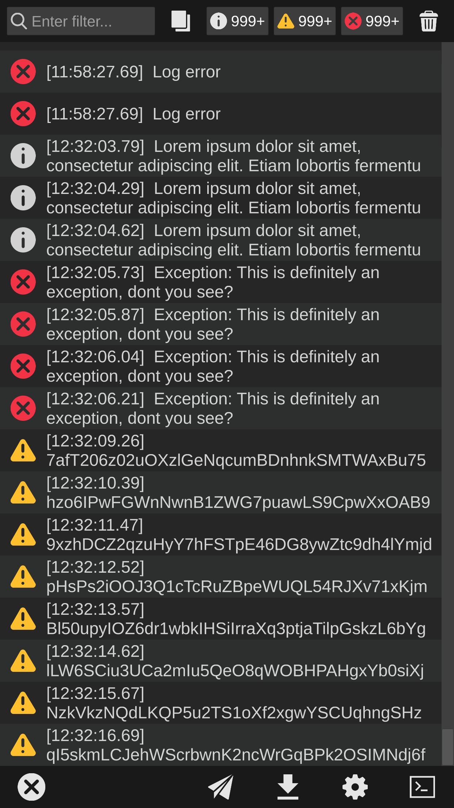
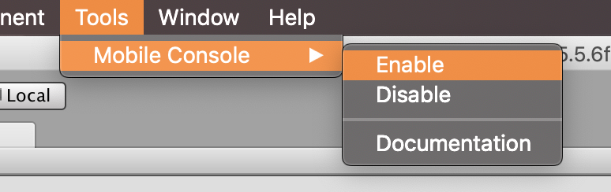
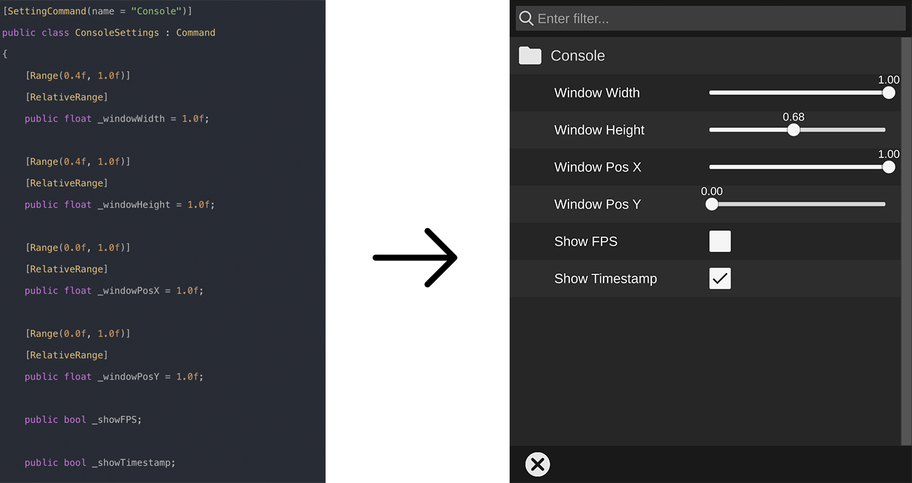
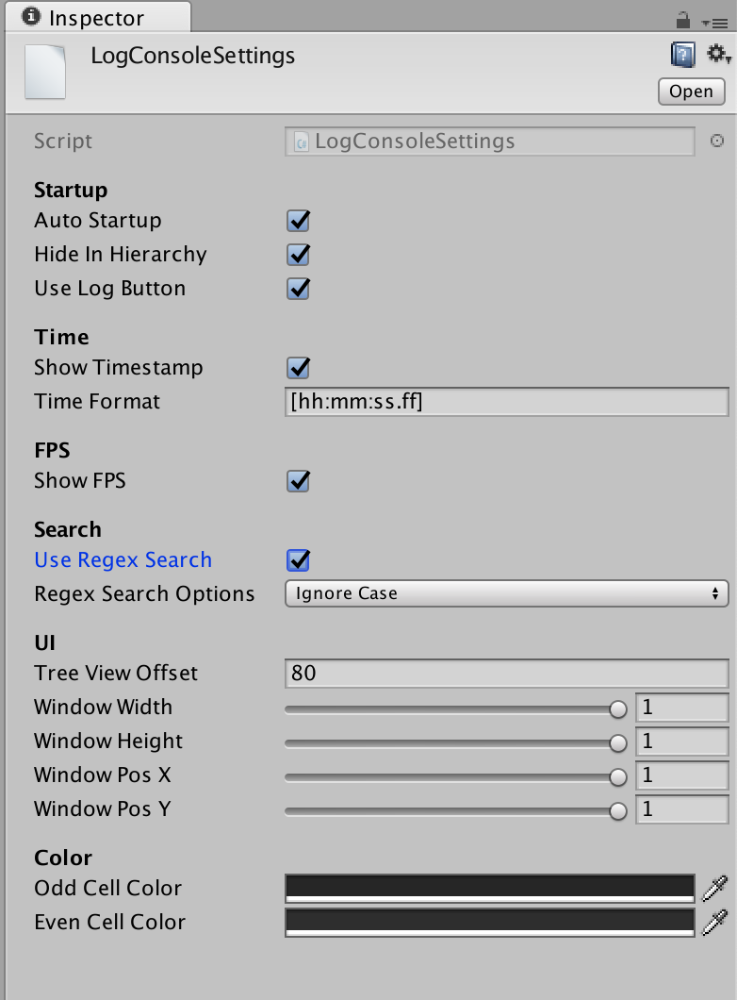

# Mobile Console Kit
Mobile Console Kit is a set of tools that help you monitor your mobile game.


**NOTE**: Mobile Console Kit depends on **TextMesh Pro** for high performance and customization. You need to install TextMesh Pro before installing Mobile Console Kit

[Video demo](https://youtu.be/IGDuiXixl1Q)



## Key Features
- Easy enable/disable with a single click and does not modify your scenes (no trace left)
- High optimization, can handle thousands of logs smoothly
- Filter logs by type or keyword with **Regex** support
- Easy to share log to any service
- User-defined settings and commands
- Unified portrait and landscape UI
- And many standard features that will help you on your daily basis

## Roadmap
### Coming in next major releases
- [Executable Command] Support drop-down for string
- [Executable Command] Support Array/List
- [Executable Command] Support custom buttons
- [Executable/Setting Command] Support reorder
- [Log] Support log channel
- [Feature] FPS recorder: The idea is you can view and export the FPS history throughout the game with marked events (For example you can see the FPS drops down from 60 to 40 when open setting dialog)
- [Feature] Benchmark API: Help to identify bottlenecks in logic

### Nice to have features
These features/improvements are "nice to have" and will be implemented or not base on your feedbacks
- View Scene Hierarchy
- Overlay Exception: Exceptions will be shown in your screen without open Mobile Console Window

## Questions, Feedbacks, Feature Requests and Support
Please contact me: pixeption@gmail.com

## Enable/Disable Mobile Console Kit
To enable/disable Mobile Console Kit, navigate to **Tools/Mobile Console** and choose either enable or disable



In case you want to enable/disable Mobile Console Kit programmatically, you can use these APIs:
- `MobileConsole.MobileconsoleSetupHelper.EnableMobileConsole()`
- `MobileConsole.MobileconsoleSetupHelper.DisableMobileConsole()`


## Using Log.Debug instead of Debug.Log
The UnityEngine.Debug logging APIs are not stripped from non-development builds
For more information, please check [Unity Documentation](https://docs.unity3d.com/Manual/BestPracticeUnderstandingPerformanceInUnity7.html)

Log is a wrapper class for UnityEngine.Debug which uses **Conditional** attribute and will be stripped out automatically when you disable Mobile Console Kit. Using Log is exactly the same as UnityEngine.Debug:
- `Log.Debug`
- `Log.Warning`
- `Log.Error`
- `Log.Exception`


## User-Defined Setting & Executable Commands
When in development time, you may want to do a lot of things on your device without rebuilding or reinstalling like clear all saved data, add items, make player invincible ... you name it

There are 2 types of command:
- `Setting`: Used for quick setting (Show/hide FPS text, Enable/Disable Player Invincible, Change player damage ...)
- `Executable`: Used for more complex action which can be adjusted with inputs (Reset level, Add items, Prints out inventory ...)




### Setting Command
To create a Setting Command, create a class that inherits from Command and add SettingCommand attribute. By default, all variables are saved/loaded automatically on device
Support currently :
#### Input
- int
- float
- double
- string

#### Checkbox 
- bool

#### Dropdown
- enum

#### Slider
- All number types with [Range] attribute

```csharp
[SettingCommand(name = "Console")]
public class ConsoleSettings : Command
{
    // Note that only public variable is added to Setting View
    public bool _showFPS = true; // _showFPS will be converted to human readable name (Show FPS)

    [Range(0.25f, 4.0f)]
    public float _timeScale = 1.0f;

    // Will be called before variable is loaded. Used for setting default value that can be obtained at runtime 
    public override void InitDefaultVariableValue()
    {
        
    }

    // Will be called after variable is loaded
    public override void OnVariableValueLoaded()
    {
        UpdateFPSVisibility(_showFPS);
    }

    // Handle when a variable is changed
    public override void OnValueChanged(string varName)
    {
        if (varName == "_showFPS")
        {
            UpdateFPSVisibility(_showFPS);
        }
        // ...
    }
}
```

The `name` in SettingCommand attribute is used as folder path and can have multiple levels separated by `/`, class name will be used if `name` is not specified. You can tap the folder to collapse its childs

### Executable Command
To create an Executable Command, create a class that inherits from Command and add ExecutableCommand attribute. By default, all variables are saved/loaded automatically on devices. Executable Command supports all variable types that Setting Command supports

Executable Command has 2 types:
- Simple Command: has no public variable and executes when clicking
- Complex Command: has more than 1 public variable, a Command Detail View will be opened when clicking on complex command, from there you can change variables before executing

```csharp
[ExecutableCommand(name = "System/App Info")]
public class AppInfoCommand : Command
{
    // Will be called before variable is loaded. Used for setting default value that can be obtained at runtime 
    public override void InitDefaultVariableValue()
    {
    }

    // Will be called after variable is loaded
    public override void OnVariableValueLoaded()
    {
    }

    // Handle when a variable is changed
    public override void OnValueChanged(string varName)
    {
    }

    // Is called when click on execute button
    public override void Execute()
    {
        StringBuilder sb = new StringBuilder();
        sb.AppendLine("App name: " + Application.productName);
        sb.AppendLine("Bundle identifier: " + Application.identifier);
        sb.AppendLine("App version: " + Application.version);

        Log.Debug(sb.ToString());
    }
}
```

### Commands With Zenject
As Zenject is becoming more and more popular with Unity developers, you might want to use Zenject with commands. Here is how:
```csharp
using MobileConsole;

void OnInitialized()
{
    // Check if commands have been created
    if (LogConsole.IsCommandsCreated())
    {
        OnCommandCreated(LogConsole.GetCommands());
    }
    else
    {
        LogConsole.OnCommandsCreated += OnCommandCreated;
    }
}

void OnCommandCreated(List<Command> commands)
{
    foreach (var command in commands)
    {
        Container.Inject(command);
    }
}

```


## Mobile Console Settings
Asset file: `Mobile Console/Resources/LogConsoleSettings.assets`


### Startup
#### Auto Startup
By default, Mobile Console Kit load LogConsole scene automatically, you can use the below code in case you want to load it later:
`SceneManager.LoadSceneAsync("LogConsole", LoadSceneMode.Additive);`

#### Hide In Hierarchy
After LogConsole is loaded, the root GameObject will be hidden from Hierarchy and the scene will be unloaded as you don't need to worry about it

#### Use Log Button
If the log button does not fit your game, you can write your own code to show Mobile Console Window via API `MobileConsole.LogConsole.Show()`
For example, you might want open Mobile Console Window by swiping 2 fingers from bottom to top

### Time
#### Show Timestamp
Default value, can be changed in Setting View

#### Time Format
Time format is based on [C# Time Format](https://docs.microsoft.com/en-us/dotnet/standard/base-types/custom-date-and-time-format-strings)

### FPS
#### Show FPS
Default value, can be changed in Setting View

### Search
#### Use Regex Search

### UI
#### Tree View Offset
The child offset in x-axis compare to its parent

#### Window Properties
Default values for Window sizes and positions

### Color
#### Cell Colors
Change colors for odd and even cells